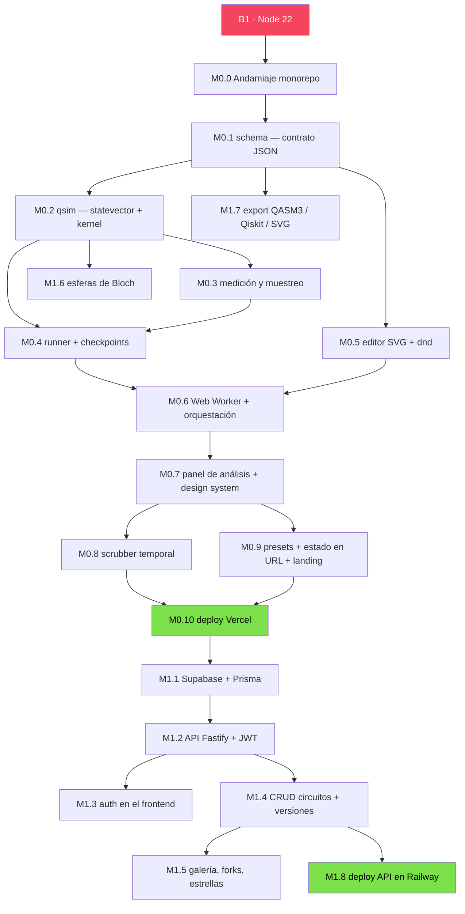

# Plan de trabajo — The Q Simulator

Documento operativo derivado de [`especificacion.md`](./especificacion.md). La spec dice **qué** se construye; este documento dice **en qué orden, qué desbloquea qué, y cómo saber que un paso terminó**.

- Repositorio: `arnoldodany44/The-Q-Simulator`
- Rama desplegable: `main`
- Última actualización: agosto 2026

---

## 0. Estado actual y brechas del entorno

Auditoría de la máquina de desarrollo al iniciar:

| Herramienta | Estado | Requerido | Acción |
|---|---|---|---|
| Repo git + remoto | ✅ conectado | — | listo |
| `.gitignore` | ✅ creado | — | listo |
| Node.js | ⚠️ **v18.20.8** | **v22 LTS** | **bloqueante — B1** |
| npm | ✅ 9.8.1 | — | solo para bootstrap |
| corepack | ✅ presente | — | habilita pnpm sin instalar nada |
| pnpm | ❌ ausente | v10 | `corepack enable pnpm` (tras B1) |
| Docker | ❌ ausente | Redis local | bloqueante desde Fase 2 — B9 |
| GitHub CLI (`gh`) | ❌ ausente | opcional | facilita PRs; no bloqueante |

**Por qué Node 18 no sirve:** llegó a fin de vida en abril de 2025 (ya no recibe parches de seguridad), y Vite 7 exige Node ≥ 20.19. Intentar arrancar sobre 18 produce fallos de instalación confusos que cuestan más que la actualización.

---

## 1. Decisiones a congelar antes de escribir código

Estas seis decisiones contaminan todo el código si se cambian tarde. Se deciden ahora y se escriben en el README.

| # | Decisión | Recomendación | Por qué |
|---|---|---|---|
| **D1** | **Endianness** | **Little-endian: qubit 0 = bit menos significativo** | Es la convención de Qiskit. Cualquier otra hace que la exportación a Qiskit dé resultados invertidos, y ese bug es infernal de rastrear (riesgo #2 de la spec). El índice `i` del statevector tiene el bit `q` en `(i >> q) & 1`. |
| **D2** | **Idioma de la UI** | **Trilingüe desde el día 1: `es`, `en`, `fr`** con `react-i18next`. Fallback `en`, detección por navegador, selector manual persistido | Decidido por el propietario del proyecto. Ver §1.1 para las consecuencias operativas. |
| **D3** | **Scope npm de los paquetes** | `@qsim/*` (`@qsim/core`, `@qsim/schema`, …) | Corto, disponible, y sobrevive a la extracción futura de `qsim` a repo público. |
| **D4** | **Serialización de circuito en URL** | JSON minificado → deflate → base64url | Un Bell cabe en ~80 caracteres. Evita depender del backend en Fase 0. |
| **D5** | **Test runner** | **Vitest** en todos los paquetes | Un solo runner para navegador y Node, comparte config con Vite, soporta workers. |
| **D6** | **Precisión y tolerancia** | `Float64`, renormalizar cada 64 compuertas, tolerancia de test `1e-10` | Riesgo #3 de la spec. Fijarlo evita tests intermitentes. |

**Defaults que tomo yo salvo que digas lo contrario:** Tailwind v4 + shadcn/ui, React Router v7 en modo declarativo, ESLint 9 flat config, Prettier, Conventional Commits, `pnpm` + `turbo`.

### 1.1 Consecuencias de la decisión trilingüe (D2)

Tres locales desde el día 1 es la opción sin refactor futuro, pero tiene costos reales que conviene tener por escrito:

**Lo que hay que montar en M0.0** (antes era "opcional", ahora es infraestructura):
- `react-i18next` + `i18next-browser-languagedetector`, con los catálogos en `apps/web/src/locales/{es,en,fr}/`
- Namespaces separados: `common`, `editor`, `gates`, `analysis`, `landing`, `lessons`. Sin esto, el catálogo se vuelve un archivo de miles de líneas imposible de mantener.
- Regla de lint (`i18next/no-literal-string`) en `apps/web` para que ningún string se cuele hardcodeado. Es la única forma de que tres locales no se desincronicen solos.
- Test de CI que verifica **paridad de claves** entre los tres catálogos: si `es` tiene una clave que `fr` no tiene, el build falla.
- Formato de números y ángulos con `Intl.NumberFormat` por locale — relevante porque la tabla de amplitudes muestra decimales, y `fr` usa coma decimal.

**Lo que NO se traduce** (queda en notación estándar internacional, igual en los tres):
- Nombres y símbolos de compuertas: `H`, `CNOT`, `Rz(θ)`, `√X`. Traducirlos rompería la correspondencia con Qiskit y con toda la literatura.
- Notación de estados: `|000⟩`, `a + bi`.
- Términos con nombre propio: Bloch, Q-sphere, GHZ, Bell, Grover, Deutsch–Jozsa.

**Dónde se paga el costo:** en la **Fase 3**. Las lecciones guiadas son prosa técnica larga sobre superposición, interferencia y teletransportación, y son nueve. Multiplicadas por tres locales, la traducción es una carga sustancial y el vocabulario cuántico en francés es específico (*intrication* para entrelazamiento, *portes quantiques*, *état intriqué*). Recomendación: **texto de lecciones con revisión humana nativa antes de publicar en `fr`**, o marcar `fr` como beta en esa sección. La UI de Fase 0 y 1 son etiquetas cortas y ahí el riesgo es bajo.

**Presupuesto de tamaño:** los tres catálogos se cargan con `lazy()` por locale, no de golpe. El bundle inicial solo lleva el locale activo.

---

## 2. Grafo de dependencias del build

Los nodos verdes son los dos hitos demostrables: **M0.10** (app pública jugable) y **M1.8** (producto real con cuentas).

---

## 3. Fase 0 — Núcleo jugable

**Objetivo:** una URL pública donde arrastras H + CNOT y ves el entrelazamiento. Sin cuentas, sin backend.
**Criterio de terminado de la fase:** un desconocido abre el link en su teléfono, toca "Bell", y entiende qué pasó.

> **Regla de congelación de alcance** (riesgo #1 de la spec): nada de la Fase 1+ entra a la Fase 0. Si surge una idea, va a `docs/backlog.md`, no al código.

---

### M0.0 — Andamiaje del monorepo · `chore/scaffold`

Estructura de §12.2, sin código de dominio todavía.

- `pnpm-workspace.yaml`, `package.json` raíz, `turbo.json`, `tsconfig.base.json`
- `packages/config`: ESLint flat config, Prettier, preset de Tailwind, tsconfigs base
- `apps/web`: Vite + React 19 + TS, arranca en blanco
- `packages/qsim`, `packages/schema`: paquetes vacíos con build y test configurados
- **i18n (D2)**: `react-i18next` + detector, catálogos `es`/`en`/`fr` por namespace, regla de lint anti-literales, test de paridad de claves (§1.1)
- `.github/workflows/ci.yml`: install → lint → typecheck → test → build
- `dependency-cruiser` con las 4 reglas de §12.3
- README con **D1–D6 escritas explícitamente**

**Definición de terminado**
- `pnpm dev` levanta `apps/web` en `localhost:5173`
- `pnpm turbo lint typecheck test build` pasa en verde localmente y en CI
- Una importación de `apps/web` desde `packages/qsim` **falla** el check de dependencias
- Un string hardcodeado en un componente **falla** el lint
- Una clave presente en `es` pero ausente en `fr` **falla** el test de paridad

**Tamaño:** M · **Bloqueado por:** B1

---

### M0.1 — `@qsim/schema`: el contrato de circuito · `feat/schema`

El JSON de §6 es el eje del sistema entero. Se hace primero y bien.

- Tipos TS + esquemas Zod para `Circuit`, `Operation`, `Parameter`, `Condition`, `CustomGate`
- Validaciones semánticas más allá de la forma:
  - dos operaciones en la misma `column` no comparten qubit
  - `targets`/`controls` dentro de `[0, qubits)`
  - sin solapamiento entre `targets` y `controls` de una misma operación
  - `clbitTargets` dentro de `[0, clbits)`
  - parámetros simbólicos referenciados existen en `parameters`
  - sin ciclos en `customGates`
- Helpers puros: `gateCount()`, `depth()`, `normalizeColumns()`, `emptyCircuit(n)`
- Catálogo de metadatos de compuertas: aridad, nº de params, símbolo, categoría

**Definición de terminado**
- Los 5 ejemplos de operación de §6 validan
- Suite de circuitos malformados, cada uno rechazado con un mensaje de error accionable
- `depth()` verificado contra casos calculados a mano

**Tamaño:** M

---

### M0.2 — `@qsim/core`: statevector y kernel de aplicación · `feat/qsim-statevector`

**El corazón técnico del proyecto.** Cero dependencias, cero DOM, cero Node APIs.

- `statevector.ts`: par de `Float64Array` (re, im), `alloc(n)`, `reset()`, `norm()`, `renormalize()`
- `gates.ts`: matrices 2×2 de I, X, Y, Z, H, S, S†, T, T†, √X; y las parametrizadas Rx, Ry, Rz, P, U
- `apply.ts`: **el kernel**
  - `apply1q(sv, matrix, target)` — recorrido por pares de índices, O(2ⁿ), sin allocs
  - `applyControlled(sv, matrix, target, controls[])` — con soporte de controles negativos
  - `apply2q(sv, matrix4x4, q0, q1)` — agrupación de 4 índices
  - SWAP / iSWAP como casos especializados
- **La convención de endianness (D1) documentada en el encabezado del archivo**, con un ejemplo numérico

**Definición de terminado** — la suite de §13 en verde:
- Bell → `[1/√2, 0, 0, 1/√2]`
- GHZ-3 → `[1/√2, 0,0,0,0,0,0, 1/√2]`
- Identidades `H·H = I`, `X·Y·Z = iI`, `T⁸ = I`
- Norma preservada tras cada compuerta (tolerancia `1e-10`)
- **Property-based** (fast-check): para unitarias 2×2 aleatorias y estados aleatorios, `U†·U|ψ⟩ = |ψ⟩`
- Test explícito de endianness: `X` en q0 de un sistema de 3 qubits lleva `|000⟩ → |001⟩` en índice 1
- Benchmark: 20 qubits × 200 compuertas en menos de 1 s

**Tamaño:** L · **El milestone de mayor riesgo de toda la Fase 0.** Un signo equivocado no lanza excepción, solo miente.

---

### M0.3 — Medición y muestreo · `feat/qsim-measure`

- `probabilities()` (regla de Born) y `marginalProbability(qubit)`
- Muestreo de shots: CDF + búsqueda binaria; método *alias* si shots > 10 000
- `collapse(qubit, outcome)`: anular amplitudes incompatibles y renormalizar
- Dos modos de ejecución **explícitamente separados**:
  - `analytic` — estado final, prohíbe medición intermedia
  - `trajectories` — una trayectoria por shot, permite medición intermedia y condicionales
- RNG con semilla inyectable (tests deterministas)

**Definición de terminado**
- Bell con 10 000 shots → test chi-cuadrado no rechaza 50/50 (semilla fija)
- Teletransportación → fidelidad 1.0 para 20 estados de entrada aleatorios
- Circuito con medición intermedia rechazado en modo `analytic` con error claro

**Tamaño:** M

---

### M0.4 — Runner de circuitos con checkpoints · `feat/qsim-runner`

- `run(circuit, options)`: recorre columnas, resuelve parámetros simbólicos, aplica operaciones, respeta `barrier`/`reset`/condicionales
- Caché incremental de §5.6: checkpoint del statevector cada K columnas (K ≈ 8, medible)
- `runFrom(checkpoint, fromColumn)` para re-simulación parcial
- Invalidación: al editar la columna *c*, se descartan los checkpoints ≥ *c*

**Definición de terminado**
- Re-simulación incremental idéntica (dentro de `1e-12`) a la simulación completa, en 200 ediciones aleatorias
- Benchmark: editar la última columna de un circuito de 40 columnas cuesta < 15 % de una simulación completa

**Tamaño:** M

---

### M0.5 — Editor visual · `feat/circuit-editor`

- `CircuitCanvas.tsx` — rejilla SVG, `QubitWire`, celdas de columna
- `GatePalette.tsx` — compuertas agrupadas por aridad
- `GateNode.tsx` — render por tipo (caja, punto de control, ⊕, línea de SWAP, barrier)
- `useCircuitStore.ts` — Zustand con middleware `temporal` (undo/redo)
- Interacciones: arrastrar de paleta a celda, mover, borrar, click en control, editar parámetro (slider + campo), añadir/quitar qubit, reordenar qubits
- Atajos: Ctrl+Z / Ctrl+Shift+Z, Supr, Ctrl+C/V, 1-9 para seleccionar compuerta
- Accesibilidad: navegación por teclado en la rejilla, `aria-label` por celda, foco visible

**Definición de terminado**
- E2E Playwright: arrastrar H a (q0, c0), CNOT de q0 a q1, y el estado del store coincide con el JSON de Bell esperado
- Undo/redo de 50 operaciones sin corromper el estado
- Circuito completo construible **solo con teclado**
- Selector de idioma funcional: la UI cambia entre `es`/`en`/`fr` sin recargar, y la preferencia persiste

**Tamaño:** L

---

### M0.6 — Web Worker y orquestación de simulación · `feat/simulation-worker`

- `simulation.worker.ts` — envuelve `@qsim/core`, protocolo de mensajes tipado
- `useSimulation.ts` — debounce de 150 ms, cancelación del trabajo previo, estados loading/error
- Transferencia con `SharedArrayBuffer` si los headers COOP/COEP lo permiten; `transferable` como fallback
- Umbral duro: > 20 qubits en cliente muestra aviso en vez de congelar la pestaña

**Definición de terminado**
- Simulación de 20 qubits sin bloquear la UI (el editor sigue respondiendo a 60 fps)
- Editar rápido 10 veces seguidas dispara una sola simulación y ningún resultado obsoleto pisa al actual

**Tamaño:** M

---

### M0.7 — Panel de análisis y sistema de diseño · `feat/analysis-panel`

- Tokens de diseño de §10: paleta, `hue = fase · 180/π`, Space Grotesk / Inter / IBM Plex Mono
- `ProbabilityHistogram.tsx` con **los fasores** — el elemento firma. Vector rotante por barra, animado con la fase; congelado y con ángulo numérico bajo `prefers-reduced-motion`
- `AmplitudeTable.tsx` — `|estado⟩`, `a + bi`, magnitud, probabilidad, fase en rad y grados
- Control de shots (1 – 100 000) con comparación empírico vs. teórico
- Modo responsivo: en < 768 px el editor pasa a lectura + toque (riesgo #6)

**Definición de terminado**
- Bell muestra exactamente dos barras al 50 %
- Mover el slider de una Rz hace girar los fasores de forma visible y continua
- Contraste AA en texto y foco; auditoría de Lighthouse de accesibilidad ≥ 95

**Tamaño:** L

---

### M0.8 — Scrubber temporal · `feat/timeline-scrubber`

La función educativa más potente del editor (§3.1). Se apoya directamente en los checkpoints de M0.4.

- Barra que recorre columna por columna; el panel de análisis refleja el estado intermedio
- Reproducción automática con control de velocidad
- La columna activa se resalta en el lienzo

**Definición de terminado**
- Recorrer un circuito de 20 columnas es fluido (< 16 ms por paso gracias a los checkpoints)
- El estado en la última columna coincide exactamente con la simulación completa

**Tamaño:** S

---

### M0.9 — Presets, estado en URL y landing · `feat/landing-and-share`

- Presets: Bell, GHZ, superposición, interferencia, Deutsch–Jozsa, teletransportación
- Serialización D4: JSON → deflate → base64url en `?c=`; carga desde URL al arrancar
- Landing que cumple el objetivo de §2: **superposición y entrelazamiento entendidos en < 1 minuto**. Circuito en vivo embebido, no una captura.
- Copy de la landing en los tres locales — es el texto más visible del producto, merece cuidado especial en `fr`

**Definición de terminado**
- Copiar la URL → abrir en ventana privada → circuito idéntico
- Un Bell serializa en menos de 120 caracteres
- Prueba con una persona real que nunca vio un circuito cuántico
- Landing legible y sin desbordes de layout en los tres idiomas (el alemán no aplica, pero el francés sí alarga: *"entrelazamiento"* → *"intrication quantique"*)

**Tamaño:** M

---

### M0.10 — Despliegue en Vercel · `chore/deploy-web`

- Proyecto en Vercel con root `apps/web`, install desde la raíz con `--frozen-lockfile`, "Include files outside the root directory" activado
- Watch paths de §12.4
- Headers COOP/COEP para `SharedArrayBuffer`
- Dominio, meta tags de Open Graph, Sentry opcional

**Definición de terminado**
- URL pública funcionando desde un dispositivo ajeno
- Cada PR genera un preview deploy
- **🎉 Fase 0 cerrada — el proyecto ya es demostrable**

**Tamaño:** S · **Bloqueado por:** B5

---

## 4. Fase 1 — Producto real

**Objetivo:** cuentas, persistencia, galería. Con esto, Fase 0 + Fase 1 ya son la app completa y defendible que menciona §14.

| Hito | Contenido | Tamaño | Bloqueos |
|---|---|---|---|
| **M1.1** | Proyecto Supabase (dev + prod). `packages/db` con Prisma. Esquema de §7 **con el ajuste de Supabase Auth**: fuera `Account` y `passwordHash`; `User.id` como `@db.Uuid`. Trigger sobre `auth.users`. Doble URL (pooler + directa) de §12.6 | M | **B4** |
| **M1.2** | `apps/api` con Fastify 5: verificación de JWT contra `SUPABASE_JWT_SECRET`, CORS, rate limiting, validación Zod de todo input, logging con pino, manejo de errores | M | M1.1 |
| **M1.3** | Auth en el frontend: cliente de Supabase, login con GitHub / Google / email, sesión persistente, rutas protegidas | M | **B7** |
| **M1.4** | CRUD de circuitos + versionado inmutable. `POST /circuits/:id/versions`, historial navegable, diff visual entre versiones, restaurar | L | M1.2 |
| **M1.5** | Galería pública, slugs con `nanoid`, visibilidad PRIVATE/UNLISTED/PUBLIC verificada **en servidor**, forks con atribución, estrellas, tags, búsqueda | L | M1.4 |
| **M1.6** | Esferas de Bloch: traza parcial → ρ reducida → vector (§5.5), three.js con `lazy()`. **El detector visual de entrelazamiento**: en un Bell, `\|r\| = 0` | M | M0.2 |
| **M1.7** | Export a OpenQASM 3, código Qiskit, SVG/PNG, JSON. `packages/qasm` (serializador primero, parser en Fase 2) | M | M0.1 |
| **M1.8** | Deploy de `apps/api` en Railway, `prisma migrate deploy` como paso de release, healthcheck, Sentry | M | **B6** |
| **M1.9** | Perfil de usuario, colecciones, página de settings | M | M1.5 |

**Criterio de terminado de la fase:** un usuario se registra con GitHub, construye un circuito, lo guarda, lo hace público, otro usuario lo forkea y le da estrella. Todo en producción.

---

## 5. Fases 2 – 5 (resumen operativo)

Se detallarán al cerrar la Fase 1. Orden y dependencias clave:

- **Fase 2 — Profundidad técnica.** `density.ts` + `noise.ts` (Kraus, §5.4) → modo ruido con comparación de fidelidad · Redis + BullMQ + `apps/worker` para simulaciones > 20 qubits · compuertas personalizadas / subcircuitos · Q-sphere y métricas de entrelazamiento (entropía de von Neumann, concurrencia) · parser de QASM 2/3. **Requiere B9.**
- **Fase 3 — Aprendizaje.** Lecciones guiadas **× 3 locales** — es aquí donde se paga el costo de D2, ver §1.1 y B3b · modo reto con **validación autoritativa en servidor** usando el mismo `@qsim/core` (riesgo #5) · tablas de posiciones · embeds con CSP restrictiva.
- **Fase 4 — Hardware y escala.** Cliente de IBM Quantum como proxy · cifrado AES-256-GCM de tokens · vista comparativa ideal / ruido / real · núcleo WASM en Rust con SIMD · API pública con API keys. **Requiere B8, B10.**
- **Fase 5 — Colaboración.** Yjs CRDT · cursores compartidos · comentarios anclados a compuertas.

**Punto de extracción de `@qsim/core`** (§12.1): cuando pasen dos semanas sin cambios en su API pública. Probablemente durante la Fase 3.

---

## 6. Lo que necesito de ti

Ordenado por cuándo bloquea. Los marcados 🔴 detienen el trabajo hasta resolverse.

| # | Qué necesito | Cuándo | Cómo |
|---|---|---|---|
| 🔴 **B1** | **Instalar Node 22 LTS** | Antes de M0.0 | Descarga el instalador de nodejs.org, o `winget install OpenJS.NodeJS.LTS`. Yo habilito pnpm con corepack después. |
| **B2** | Confirmar o corregir **D1–D6** (§1) | Antes de M0.0 | Basta con "adelante" o decirme cuáles cambias. |
| ~~B3~~ | ~~Idioma de la UI (D2)~~ | ✅ **Resuelto** | Trilingüe `es`/`en`/`fr` desde el inicio. Consecuencias operativas en §1.1. |
| **B3b** | **Revisión nativa del francés** (y del inglés si quieres) para las lecciones | Fase 3 | Yo produzco las tres versiones; el vocabulario cuántico en `fr` conviene que lo valide alguien nativo antes de publicar. Alternativa: marcar `fr` como beta en lecciones. |
| **B4** | **Cuenta de Supabase** + dos proyectos (`the-q-simulator-dev`, `the-q-simulator-prod`) | Antes de M1.1 | Tú creas los proyectos y **tú pegas los valores en el `.env` local**. Yo dejo el `.env.example` con la forma exacta. No me mandes las llaves por chat. |
| **B5** | **Cuenta de Vercel** conectada al repo | Antes de M0.10 | Yo dejo la configuración documentada; tú autorizas la app de GitHub. |
| **B6** | **Cuenta de Railway** (API + worker + Redis) | Antes de M1.8 | Igual: tú creas, yo configuro los archivos de despliegue. |
| **B7** | **OAuth apps de GitHub y Google** cargadas en el dashboard de Supabase | Antes de M1.3 | Van en Authentication → Providers. El código nunca ve esos secretos (§12.5). |
| **B8** | Tu **token de IBM Quantum** para probar (plan abierto gratuito) | Fase 4 | Solo para pruebas de desarrollo, en tu `.env` local. En producción cada usuario aporta el suyo. |
| **B9** | **Docker Desktop** para Redis local | Fase 2 | Alternativa: usar Upstash y saltarse Docker. |
| **B10** | Cuenta de **Sentry** (opcional) | Fase 1 en adelante | Se puede posponer sin afectar nada. |

**Sobre secretos:** nunca me pegues llaves, tokens ni contraseñas en el chat. Yo genero `.env.example` con los nombres y el formato; tú copias los valores desde cada dashboard a tu `.env` local y a las variables de entorno de Vercel/Railway. El `.gitignore` ya excluye `.env`.

---

## 7. Convenciones operativas

- **Ramas:** una por hito, con el nombre indicado arriba (`feat/qsim-statevector`, etc.)
- **Commits:** Conventional Commits con scope de paquete — `feat(qsim): add controlled gate support`
- **PRs:** uno por hito contra `main`, aunque trabajemos solos. Da preview deploy y corre CI (§12.7)
- **Idioma:** código, comentarios, README y commits en **inglés**; `docs/` y notas internas en **español**
- **Tests de `@qsim/core` corren en cada cambio**, sin importar el filtro de turbo (§12.8) — un error de física es silencioso
- **Backlog:** toda idea fuera de la fase actual va a `docs/backlog.md`, nunca al código

---

## 8. Orden de arranque inmediato

1. **B1** — instalas Node 22 ← *lo único que falta*
2. ~~**B2** — decisiones D1–D6~~ ✅ D2 resuelta (trilingüe); D1, D3–D6 quedan en la recomendación salvo que digas lo contrario
3. Yo ejecuto **M0.0** (andamiaje + infraestructura i18n) y abro el primer PR
4. Yo ejecuto **M0.1** y **M0.2** — el contrato y el motor, que es donde está el valor técnico real
5. Revisamos el motor con sus tests antes de tocar una sola línea de UI

El motor antes que la interfaz, siempre. Si el motor miente, la interfaz miente bonito.
