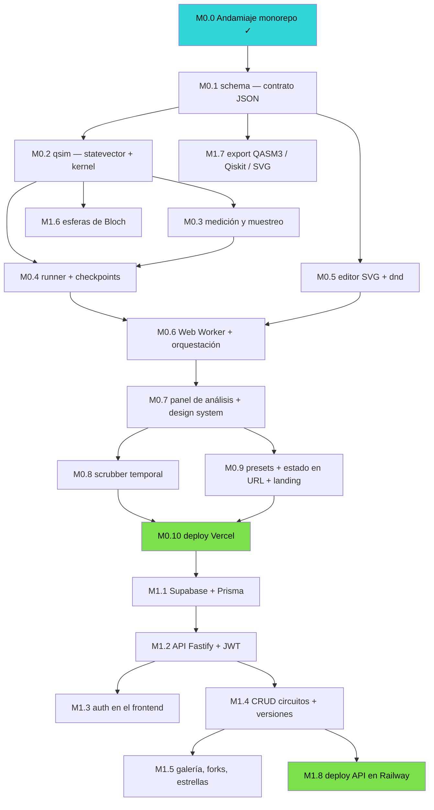

# Plan de trabajo — The Q Simulator

Documento operativo derivado de [`especificacion.md`](./especificacion.md). La spec dice **qué** se construye; este documento dice **en qué orden, qué desbloquea qué, y cómo saber que un paso terminó**.

- Repositorio: `arnoldodany44/The-Q-Simulator`
- Rama desplegable: `main`
- Última actualización: agosto 2026 — Fases 0 a 5 completas

---

## 0. Estado actual del entorno

| Herramienta       | Estado               | Nota                                               |
| ----------------- | -------------------- | -------------------------------------------------- |
| Repo git + remoto | ✅ conectado         | `arnoldodany44/The-Q-Simulator`                    |
| Node.js           | ✅ **v24.19.0**      | LTS actual; supera el v22 que pedía la spec        |
| pnpm              | ✅ **v11.21.0**      | vía corepack, ver nota abajo                       |
| Monorepo          | ✅ **M0.0 completo** | 4 workspaces, CI, fronteras, i18n trilingüe        |
| Docker            | ❌ ausente           | dejó de bloquear: Redis se tomó gestionado, ver B9 |
| GitHub CLI (`gh`) | ❌ ausente           | opcional; facilita PRs                             |

**Detalle de la instalación de pnpm.** `corepack enable pnpm` falla con `EPERM` porque intenta escribir los shims en `C:\Program Files\nodejs`, que requiere elevación. La solución sin permisos de administrador fue apuntar corepack al directorio de npm del usuario, que ya está en el `PATH`:

```bash
corepack enable --install-directory "$APPDATA/npm" pnpm
```

**Anomalía menor, sin impacto.** Hay un `npm` viejo en `%APPDATA%\npm` que le hace sombra al 11.17.0 que trae Node 24, y por eso `npm --version` reporta 9.8.1. El proyecto usa pnpm para todo, así que no afecta; queda anotado por si algún día confunde.

---

## 1. Decisiones a congelar antes de escribir código

Estas seis decisiones contaminan todo el código si se cambian tarde. Se deciden ahora y se escriben en el README.

| #      | Decisión                             | Recomendación                                                                                                                          | Por qué                                                                                                                                                                                                                           |
| ------ | ------------------------------------ | -------------------------------------------------------------------------------------------------------------------------------------- | --------------------------------------------------------------------------------------------------------------------------------------------------------------------------------------------------------------------------------- |
| **D1** | **Endianness**                       | **Little-endian: qubit 0 = bit menos significativo**                                                                                   | Es la convención de Qiskit. Cualquier otra hace que la exportación a Qiskit dé resultados invertidos, y ese bug es infernal de rastrear (riesgo #2 de la spec). El índice `i` del statevector tiene el bit `q` en `(i >> q) & 1`. |
| **D2** | **Idioma de la UI**                  | **Trilingüe desde el día 1: `es`, `en`, `fr`** con `react-i18next`. Fallback `en`, detección por navegador, selector manual persistido | Decidido por el propietario del proyecto. Ver §1.1 para las consecuencias operativas.                                                                                                                                             |
| **D3** | **Scope npm de los paquetes**        | `@qsim/*` (`@qsim/core`, `@qsim/schema`, …)                                                                                            | Corto, disponible, y sobrevive a la extracción futura de `qsim` a repo público.                                                                                                                                                   |
| **D4** | **Serialización de circuito en URL** | JSON minificado → deflate → base64url                                                                                                  | Un Bell cabe en ~80 caracteres. Evita depender del backend en Fase 0.                                                                                                                                                             |
| **D5** | **Test runner**                      | **Vitest** en todos los paquetes                                                                                                       | Un solo runner para navegador y Node, comparte config con Vite, soporta workers.                                                                                                                                                  |
| **D6** | **Precisión y tolerancia**           | `Float64`, renormalizar cada 64 compuertas, tolerancia de test `1e-10`                                                                 | Riesgo #3 de la spec. Fijarlo evita tests intermitentes.                                                                                                                                                                          |

**Defaults que tomo yo salvo que digas lo contrario:** Tailwind v4 + shadcn/ui, React Router (v8, modo declarativo), ESLint flat config, Prettier, Conventional Commits, `pnpm` + `turbo`. Las versiones exactas y su justificación están en §1.2.

### 1.1 Consecuencias de la decisión trilingüe (D2)

Tres locales desde el día 1 es la opción sin refactor futuro, pero tiene costos reales que conviene tener por escrito:

**Lo que hay que montar en M0.0** (antes era "opcional", ahora es infraestructura):

- `react-i18next` + `i18next-browser-languagedetector`, con los catálogos en `apps/web/src/i18n/locales/{es,en,fr}/`
- Namespaces separados, uno por área de funcionalidad, para que ningún catálogo crezca hasta ser irrevisable. Se crean junto con la funcionalidad que los necesita, no por adelantado: M0.0 dejó `common` y `landing`; `editor` y `gates` llegan con M0.5, `analysis` con M0.7, `lessons` en Fase 3.
- Regla de lint (`i18next/no-literal-string`) en `apps/web` para que ningún string se cuele hardcodeado. Es la única forma de que tres locales no se desincronicen solos.
- Test de CI que verifica **paridad de claves** entre los tres catálogos: si `es` tiene una clave que `fr` no tiene, el build falla.
- Formato de números y ángulos con `Intl.NumberFormat` por locale — relevante porque la tabla de amplitudes muestra decimales, y `fr` usa coma decimal.

**Lo que NO se traduce** (queda en notación estándar internacional, igual en los tres):

- Nombres y símbolos de compuertas: `H`, `CNOT`, `Rz(θ)`, `√X`. Traducirlos rompería la correspondencia con Qiskit y con toda la literatura.
- Notación de estados: `|000⟩`, `a + bi`.
- Términos con nombre propio: Bloch, Q-sphere, GHZ, Bell, Grover, Deutsch–Jozsa.

**Dónde se paga el costo:** en la **Fase 3**. Las lecciones guiadas son prosa técnica larga sobre superposición, interferencia y teletransportación, y son nueve. Multiplicadas por tres locales, la traducción es una carga sustancial y el vocabulario cuántico en francés es específico (_intrication_ para entrelazamiento, _portes quantiques_, _état intriqué_). Recomendación: **texto de lecciones con revisión humana nativa antes de publicar en `fr`**, o marcar `fr` como beta en esa sección. La UI de Fase 0 y 1 son etiquetas cortas y ahí el riesgo es bajo.

**Presupuesto de tamaño:** los tres catálogos se cargan con `lazy()` por locale, no de golpe. El bundle inicial solo lleva el locale activo. Verificado en el build de M0.0: Vite emite `common-*.js` y `landing-*.js` por separado para cada idioma, de ~0.2 kB cada uno.

**Mecanismo para lo que no se traduce.** El componente `<Notation value="…" />` (`apps/web/src/components/Notation.tsx`) es la única vía sancionada para texto técnico invariante. El texto viaja como prop, no como hijo JSX, precisamente para que `i18next/no-literal-string` siga teniendo dientes: un string suelto en JSX sigue siendo un error, y pasar por `Notation` es una decisión registrada en el código. Además marca `translate="no"`, que impide que el traductor automático de Chrome convierta una etiqueta `CNOT` en otra cosa.

### 1.2 Versiones fijadas y por qué

Las versiones viven en un **catálogo de pnpm** (`pnpm-workspace.yaml`), no repetidas en cada `package.json`. Los paquetes las referencian con `"catalog:"`, así que subir una versión se hace en un solo lugar y es imposible que dos workspaces queden desalineados.

**La decisión no obvia: TypeScript 6.0.3, no 7.0.2.**

TypeScript 7 (el compilador nativo en Go) es el `latest` del registro, pero `typescript-eslint@8.67.0` declara `typescript: ">=4.8.4 <6.1.0"` y no lo soporta. Adoptar TS 7 hoy significaría quedarse sin lint con información de tipos — y con ello sin las reglas de frontera ni la regla anti-literales que son la mitad de la infraestructura de M0.0. La versión estable más alta que sí está soportada es 6.0.3.

**Cuándo revisar:** cuando typescript-eslint publique una mayor que admita TS 7. Es un cambio de una línea en el catálogo más una corrida de `pnpm verify`.

Otras versiones notables, todas verificadas contra el registro al momento de instalar: Vite 8.2.1, Vitest 4.1.10, React 19.2.8, ESLint 10.8.1, Zod 4.4.3, Turbo 2.10.10.

---

## 2. Grafo de dependencias del build



Los nodos verdes son los dos hitos demostrables: **M0.10** (app pública jugable) y **M1.8** (producto real con cuentas).

---

## 3. Fase 0 — Núcleo jugable

**Objetivo:** una URL pública donde arrastras H + CNOT y ves el entrelazamiento. Sin cuentas, sin backend.
**Criterio de terminado de la fase:** un desconocido abre el link en su teléfono, toca "Bell", y entiende qué pasó.

> **Regla de congelación de alcance** (riesgo #1 de la spec): nada de la Fase 1+ entra a la Fase 0. Si surge una idea, va a `docs/backlog.md`, no al código.

---

### M0.0 — Andamiaje del monorepo · ✅ **COMPLETADO**

Estructura de §12.2. Cuatro workspaces: `web`, `@qsim/core`, `@qsim/schema`, `@qsim/config`.

- `pnpm-workspace.yaml` con **catálogo de versiones** (§1.2), `package.json` raíz, `turbo.json`, `tsconfig.base.json`
- `packages/config`: ESLint flat config (base + react), tsconfigs (base / lib / react / node)
- `apps/web`: Vite 8 + React 19 + TS, con headers COOP/COEP ya puestos para el `SharedArrayBuffer` de M0.6
- `packages/qsim`: la convención de endianness **codificada y probada**, no solo documentada
- `packages/schema`: `CIRCUIT_SCHEMA_VERSION`, a la espera del contrato completo en M0.1
- **i18n (D2)**: carga perezosa por locale, catálogos `es`/`en`/`fr`, componente `Notation` para lo intraducible
- `.github/workflows/ci.yml`: dos jobs — el de verificación completa, y uno que corre el motor **siempre** sin filtro (§12.8)
- `dependency-cruiser` con 7 reglas
- README con D1–D6 explícitas

**Definición de terminado — verificada**

| Criterio                                                           | Resultado                                              |
| ------------------------------------------------------------------ | ------------------------------------------------------ |
| `pnpm dev` levanta `apps/web` en `localhost:5173`                  | ✅ renderiza, sin errores de consola                   |
| `pnpm verify` en verde (lint, typecheck, test, build, fronteras)   | ✅ 10 tareas, 10 tests, 0 violaciones                  |
| Import de `apps/web` desde `packages/qsim` **falla** las fronteras | ✅ `error packages-no-apps`, exit 1                    |
| String hardcodeado **falla** el lint                               | ✅ `i18next/no-literal-string`, exit 1                 |
| Clave presente en `fr` pero ausente en `en` **falla** la paridad   | ✅ 2 tests rojos, exit 1                               |
| Los tres idiomas cargan, cambian en caliente y persisten           | ✅ probado en navegador, incluida recarga              |
| La notación técnica no se traduce                                  | ✅ `@qsim/core`, `\|101⟩` intactos en los tres idiomas |

**Nota de implementación.** Los `tsconfig` de `packages/config` extienden un `./base.json` hermano en vez de un `../../../tsconfig.base.json` del repo. El transformador oxc de Vite 8 no resuelve el symlink de pnpm antes de seguir la cadena de `extends`, así que la ruta relativa se salía del repo y rompía los tests. Mantener los `extends` dentro del propio paquete lo evita. `tsconfig.base.json` en la raíz sigue existiendo (lo usa dependency-cruiser) pero ahora solo reexporta.

**Reglas de frontera activas:** las 4 de §12.3 más `qsim-has-no-dependencies`, `no-circular` y `no-orphans`. La regla de "sin APIs de Node" en los paquetes compartidos se refuerza además a nivel de tipos: `packages/config/tsconfig/lib.json` fija `"types": []`, así que `process` y `Buffer` ni siquiera están en alcance.

---

### M0.1 — `@qsim/schema`: el contrato de circuito · `feat/schema`

El JSON de §6 es el eje del sistema entero. Se hace primero y bien.

- Tipos TS + esquemas Zod para `Circuit`, `Operation`, `Parameter`, `Condition`, `CustomGate`
- Validaciones semánticas más allá de la forma:
  - dos operaciones en la misma `column` no comparten qubit
  - `targets`/`controls` dentro de `[0, qubits)`
  - sin solapamiento entre `targets` y `controls` de una misma operación
  - `clbitTargets` dentro de `[0, clbits)`
  - parámetros simbólicos referenciados existen en `parameters`
  - sin ciclos en `customGates`
- Helpers puros: `gateCount()`, `depth()`, `normalizeColumns()`, `emptyCircuit(n)`
- Catálogo de metadatos de compuertas: aridad, nº de params, símbolo, categoría

**Definición de terminado**

- Los 5 ejemplos de operación de §6 validan
- Suite de circuitos malformados, cada uno rechazado con un mensaje de error accionable
- `depth()` verificado contra casos calculados a mano

**Tamaño:** M

---

### M0.2 — `@qsim/core`: statevector y kernel de aplicación · `feat/qsim-statevector`

**El corazón técnico del proyecto.** Cero dependencias, cero DOM, cero Node APIs.

- `statevector.ts`: par de `Float64Array` (re, im), `alloc(n)`, `reset()`, `norm()`, `renormalize()`
- `gates.ts`: matrices 2×2 de I, X, Y, Z, H, S, S†, T, T†, √X; y las parametrizadas Rx, Ry, Rz, P, U
- `apply.ts`: **el kernel**
  - `apply1q(sv, matrix, target)` — recorrido por pares de índices, O(2ⁿ), sin allocs
  - `applyControlled(sv, matrix, target, controls[])` — con soporte de controles negativos
  - `apply2q(sv, matrix4x4, q0, q1)` — agrupación de 4 índices
  - SWAP / iSWAP como casos especializados
- **La convención de endianness (D1) documentada en el encabezado del archivo**, con un ejemplo numérico

**Definición de terminado** — la suite de §13 en verde:

- Bell → `[1/√2, 0, 0, 1/√2]`
- GHZ-3 → `[1/√2, 0,0,0,0,0,0, 1/√2]`
- Identidades `H·H = I`, `X·Y·Z = iI`, `T⁸ = I`
- Norma preservada tras cada compuerta (tolerancia `1e-10`)
- **Property-based** (fast-check): para unitarias 2×2 aleatorias y estados aleatorios, `U†·U|ψ⟩ = |ψ⟩`
- Test explícito de endianness: `X` en q0 de un sistema de 3 qubits lleva `|000⟩ → |001⟩` en índice 1
- Benchmark: 20 qubits × 200 compuertas en menos de 1 s

**Tamaño:** L · **El milestone de mayor riesgo de toda la Fase 0.** Un signo equivocado no lanza excepción, solo miente.

---

### M0.3 — Medición y muestreo · `feat/qsim-measure`

- `probabilities()` (regla de Born) y `marginalProbability(qubit)`
- Muestreo de shots: CDF + búsqueda binaria; método _alias_ si shots > 10 000
- `collapse(qubit, outcome)`: anular amplitudes incompatibles y renormalizar
- Dos modos de ejecución **explícitamente separados**:
  - `analytic` — estado final, prohíbe medición intermedia
  - `trajectories` — una trayectoria por shot, permite medición intermedia y condicionales
- RNG con semilla inyectable (tests deterministas)

**Definición de terminado**

- Bell con 10 000 shots → test chi-cuadrado no rechaza 50/50 (semilla fija)
- Teletransportación → fidelidad 1.0 para 20 estados de entrada aleatorios
- Circuito con medición intermedia rechazado en modo `analytic` con error claro

**Tamaño:** M

---

### M0.4 — Runner de circuitos con checkpoints · `feat/qsim-runner`

- `run(circuit, options)`: recorre columnas, resuelve parámetros simbólicos, aplica operaciones, respeta `barrier`/`reset`/condicionales
- Caché incremental de §5.6: checkpoint del statevector cada K columnas (K ≈ 8, medible)
- `runFrom(checkpoint, fromColumn)` para re-simulación parcial
- Invalidación: al editar la columna _c_, se descartan los checkpoints ≥ _c_

**Definición de terminado**

- Re-simulación incremental idéntica (dentro de `1e-12`) a la simulación completa, en 200 ediciones aleatorias
- Benchmark: editar la última columna de un circuito de 40 columnas cuesta < 15 % de una simulación completa

**Tamaño:** M

---

### M0.5 — Editor visual · `feat/circuit-editor`

- `CircuitCanvas.tsx` — rejilla SVG, `QubitWire`, celdas de columna
- `GatePalette.tsx` — compuertas agrupadas por aridad
- `GateNode.tsx` — render por tipo (caja, punto de control, ⊕, línea de SWAP, barrier)
- `useCircuitStore.ts` — Zustand con middleware `temporal` (undo/redo)
- Interacciones: arrastrar de paleta a celda, mover, borrar, click en control, editar parámetro (slider + campo), añadir/quitar qubit, reordenar qubits
- Atajos: Ctrl+Z / Ctrl+Shift+Z, Supr, Ctrl+C/V, 1-9 para seleccionar compuerta
- Accesibilidad: navegación por teclado en la rejilla, `aria-label` por celda, foco visible

**Definición de terminado**

- E2E Playwright: arrastrar H a (q0, c0), CNOT de q0 a q1, y el estado del store coincide con el JSON de Bell esperado
- Undo/redo de 50 operaciones sin corromper el estado
- Circuito completo construible **solo con teclado**
- Selector de idioma funcional: la UI cambia entre `es`/`en`/`fr` sin recargar, y la preferencia persiste

**Tamaño:** L

---

### M0.6 — Web Worker y orquestación de simulación · `feat/simulation-worker`

- `simulation.worker.ts` — envuelve `@qsim/core`, protocolo de mensajes tipado
- `useSimulation.ts` — debounce de 150 ms, cancelación del trabajo previo, estados loading/error
- Transferencia con `SharedArrayBuffer` si los headers COOP/COEP lo permiten; `transferable` como fallback
- Umbral duro: > 20 qubits en cliente muestra aviso en vez de congelar la pestaña
- `SimulationPanel.tsx` — **provisional y deliberado**: el editor monta aquí `useSimulation` y muestra lo mínimo honesto (estado del pipeline, tamaño del registro, estados de la base con probabilidad, duración de la última corrida). Sin él la orquestación entera quedaba sin importador y la app nunca creaba un worker: la milestone estaba probada unidad por unidad y muerta en la aplicación. M0.7 lo sustituye en el mismo hueco por el histograma, la tabla de amplitudes y los fasores.

**Definición de terminado**

- Simulación de 20 qubits sin bloquear la UI (el editor sigue respondiendo a 60 fps)
- Editar rápido 10 veces seguidas dispara una sola simulación y ningún resultado obsoleto pisa al actual
- El pipeline es visible desde la app: `apps/web/e2e/simulation.spec.ts` construye un par de Bell con el teclado y comprueba que el panel pasa de un estado de la base a dos, con y sin aislamiento cross-origin

**Tamaño:** M

---

### M0.7 — Panel de análisis y sistema de diseño · `feat/analysis-panel`

- Tokens de diseño de §10: paleta, `hue = fase · 180/π`, Space Grotesk / Inter / IBM Plex Mono
- `ProbabilityHistogram.tsx` con **los fasores** — el elemento firma. Vector rotante por barra, animado con la fase; congelado y con ángulo numérico bajo `prefers-reduced-motion`
- `AmplitudeTable.tsx` — `|estado⟩`, `a + bi`, magnitud, probabilidad, fase en rad y grados
- Control de shots (1 – 100 000) con comparación empírico vs. teórico
- Modo responsivo: en < 768 px el editor pasa a lectura + toque (riesgo #6)

**Definición de terminado**

- Bell muestra exactamente dos barras al 50 %
- Mover el slider de una Rz hace girar los fasores de forma visible y continua
- Contraste AA en texto y foco; auditoría de Lighthouse de accesibilidad ≥ 95

**Tamaño:** L

---

### M0.8 — Scrubber temporal · `feat/timeline-scrubber`

La función educativa más potente del editor (§3.1). Se apoya directamente en los checkpoints de M0.4.

- Barra que recorre columna por columna; el panel de análisis refleja el estado intermedio
- Reproducción automática con control de velocidad
- La columna activa se resalta en el lienzo

**Definición de terminado**

- Recorrer un circuito de 20 columnas es fluido (< 16 ms por paso gracias a los checkpoints)
- El estado en la última columna coincide exactamente con la simulación completa

**Tamaño:** S

---

### M0.9 — Presets, estado en URL y landing · `feat/landing-and-share`

- Presets: Bell, GHZ, superposición, interferencia, Deutsch–Jozsa, teletransportación
- Serialización D4: JSON → deflate → base64url en `?c=`; carga desde URL al arrancar
- Landing que cumple el objetivo de §2: **superposición y entrelazamiento entendidos en < 1 minuto**. Circuito en vivo embebido, no una captura.
- Copy de la landing en los tres locales — es el texto más visible del producto, merece cuidado especial en `fr`

**La teletransportación obligó a cablear el modo `trajectories` (M0.9a).** Es el único preset que mide a mitad del circuito y condiciona una compuerta sobre un bit clásico, así que el modo analítico lo rechaza por definición (§5.3). Hasta ahora la aplicación pedía siempre una corrida analítica y el lector recibía ese rechazo donde debería estar la respuesta, lo que hacía impublicable el preset. `apps/web/src/features/simulation/mode.ts` le hace al documento la misma pregunta que le hace el motor —¿hay un `measure`, hay una `condition`?— y el panel corre esos circuitos en `trajectories`, dibujando el conteo del registro clásico (`MeasurementCounts.tsx`). Ni el scheduler ni el worker necesitaron una línea: los dos modos están en el protocolo desde M0.6 y nada en la app había pedido nunca el segundo.

**Lo que el editor todavía no puede construir.** El formato, el lienzo y el store expresan la condición clásica sin problemas: se puede abrir el preset de teletransportación, leerlo, correrlo y borrarle compuertas. Lo que no existe es el gesto para _crear_ una: `GateDraft` en `placement.ts` no tiene campo `condition` y la paleta no ofrece manera de ponerlo. Queda anotado aquí para que nadie lo redescubra intentándolo; cerrarlo no es de esta milestone.

**Definición de terminado**

- Copiar la URL → abrir en ventana privada → circuito idéntico
- Un Bell serializa en menos de 120 caracteres
- Prueba con una persona real que nunca vio un circuito cuántico
- Landing legible y sin desbordes de layout en los tres idiomas (el alemán no aplica, pero el francés sí alarga: _"entrelazamiento"_ → _"intrication quantique"_)

**Qué JSON se comprime, medido en M0.9a.** D4 dice «JSON minificado → deflate → base64url» y eso es exactamente lo que se implementa, pero el JSON que entra al deflate **no** es la forma del contrato §6: es una forma posicional, arrays anidados en vez de objetos con claves. La razón es el presupuesto de esta misma sección, medido sobre un par de Bell:

| Forma                     | JSON | deflate | base64url |
| ------------------------- | ---: | ------: | --------: |
| Contrato §6, minificado   |  172 |     113 |       151 |
| Forma empaquetada, minif. |   57 |      53 |    **58** |

Deflate no puede rescatar la primera fila: a ese tamaño su ventana todavía no tiene nada que repetir, así que los 172 bytes son casi todos nombres de clave pagados íntegros (`"schemaVersion"`, `"operations"`, `"targets"`, `"column"`) y una URL no puede permitírselos. Empaquetar deja el Bell en 58 caracteres, dentro del «~80» que estima D4 y muy por debajo del tope de 120.

La forma empaquetada es un formato **de transporte y nunca de almacenamiento**: se produce y se consume en `apps/web/src/lib/circuit-url.ts`, y lo único que sale de ese módulo es un `Circuit` que ya pasó por `parseCircuit`. Sus constantes `PACKED_CIRCUIT_KEYS` y `PACKED_OPERATION_KEYS` se comparan en test contra los esquemas Zod del contrato, de modo que un campo nuevo en `@qsim/schema` rompe un test aquí en vez de desaparecer en silencio de todos los enlaces compartidos.

**La landing son cuatro etapas, no tres (M0.9b).** El criterio de §2 no es «se ve profesional», es que alguien que nunca vio un circuito entienda dos ideas concretas. La superposición necesita dos cuadros —una certeza y el mismo registro después de una compuerta— y el entrelazamiento necesita **tres**, que es la parte que casi toda introducción se salta: dos qubits entrelazados dan dos resultados, pero un solo qubit en superposición también, así que un lector al que solo se le muestra el par de Bell no tiene con qué ver qué tiene de notable. Lo notable aparece al comparar contra dos qubits en superposición e independientes:

| Etapa | Circuito             |           Gráfico | Lo que dice                |
| ----- | -------------------- | ----------------: | -------------------------- |
| 1     | nada                 |         una barra | una certeza                |
| 2     | `H` en q0            |        dos barras | **superposición**          |
| 3     | `H` en los dos hilos | cuatro barras (¼) | dos monedas independientes |
| 4     | `H` y luego `CNOT`   |    dos barras (½) | **entrelazamiento**        |

Entre 3 y 4 las marginales no se mueven —cada qubit sigue dando 1 la mitad de las veces— y la distribución conjunta sí. Esa pareja de hechos es el entrelazamiento, y está en pantalla como dos números que el lector puede verificar contra las barras que tiene al lado: `marginalProbability` del motor para cada hilo, y la suma de las probabilidades donde los dos bits coinciden. Las etapas 3 y 4 **son** los presets `superposition` y `bell`, y un test lo afirma, para que el botón «Partir d'un exemple» lleve exactamente al circuito que el lector acaba de ver.

Las cuatro etapas se simulan de verdad, con `run()` de `@qsim/core`, y —única excepción de la app— en el hilo principal: son circuitos constantes de dos qubits, cuatro amplitudes de aritmética, y un worker solo agregaría un viaje de ida y vuelta a la página cuyo trabajo entero es entenderse en menos de un minuto. La secuencia avanza sola y se detiene en la etapa 4; bajo `prefers-reduced-motion` no arranca nunca, y el botón de pausa está siempre visible (WCAG 2.2.2).

**La landing no carga el bundle del editor (M0.9b).** `App.tsx` deja la landing en el chunk de entrada —es la puerta y no puede esperar un segundo viaje— y mete el editor en un `lazy()`. Medido con `pnpm build`:

| Chunk               |     Antes |   Después |          gzip |
| ------------------- | --------: | --------: | ------------: |
| entrada (`index-*`) | 503.09 kB | 312.73 kB | 155.1 → 100.2 |
| editor (`editor-*`) |         — | 207.91 kB |         61.98 |

Zod, dnd-kit, Zustand, Zundo y fflate quedan del lado del editor; el chunk de entrada lleva React, el router, i18next, el motor y el histograma. Un solo import puede deshacerlo sin que ningún test se ponga rojo, así que la frontera se vigila en `.dependency-cruiser.cjs` (`landing-carries-no-editor`): la landing solo puede alcanzar `geometry.ts` del editor, y los imports de tipo están exentos porque se borran antes de empaquetar. Por eso los circuitos de la demo declaran su `schemaVersion` como constante local, comparada en test contra `CIRCUIT_SCHEMA_VERSION`.

**`?example=<id>` (M0.9b).** La landing ofrece dos caminos y tienen que ser distintos: `/new` es un editor en blanco y `/new?example=bell` es el mismo editor con el circuito ya cargado. `useExample` lo lee una sola vez al montar, cede siempre ante un `?c=` —eso es trabajo de alguien, esto es un punto de partida—, ignora en silencio un nombre que no conoce, y se borra de la barra de direcciones al usarse, de modo que el `?c=` que escribe `useCircuitUrl` a continuación deja una URL canónica y compartible.

**Open Graph y Twitter (M0.9b).** `index.html` declara `og:*` y `twitter:*`, y `syncDocumentLanguage` reescribe las tres descripciones y `og:locale` junto con `<html lang>`: D2 no se detiene en los strings de la app, y una vista previa compartida es lo más visible que tiene el producto. `og:url` y `og:image` quedan fuera a propósito: ambos exigen URL absoluta del origen desplegado, que es una decisión de M0.10. Un crawler que no ejecuta JavaScript lee los valores en inglés — límite honesto de una página renderizada en cliente, y el mismo que la `description` tiene desde M0.0.

**Compresión con `fflate`, no con `CompressionStream`** (M0.9a). La plataforma sabe hacer deflate, pero `CompressionStream` es un stream y por lo tanto asíncrono: la URL se lee una sola vez, de forma síncrona, antes del primer pintado. Un decode asíncrono monta el editor sobre el documento en blanco y lo reemplaza un tick después — un parpadeo visible y una simulación de más. Además `fflate` produce bytes idénticos en Node y en el navegador, lo que importa cuando la Fase 1 empiece a generar enlaces desde el servidor. Un navegador sin `CompressionStream` (Safari anterior a 16.4 y los webviews construidos sobre él) necesitaría igualmente un inflador incluido en el bundle, así que usarlo siempre deja un solo camino de código en vez de dos. Costo: ~8 kB, menos que uno de los tres archivos de tipografía.

**Tamaño:** M

---

### M0.10 — Despliegue en Vercel · `chore/deploy-web`

- Proyecto en Vercel con root `apps/web`, install desde la raíz con `--frozen-lockfile`, "Include files outside the root directory" activado
- Watch paths de §12.4
- Headers COOP/COEP para `SharedArrayBuffer`
- Dominio, meta tags de Open Graph, Sentry opcional

**Definición de terminado**

- URL pública funcionando desde un dispositivo ajeno
- Cada PR genera un preview deploy
- **🎉 Fase 0 cerrada — el proyecto ya es demostrable**

**Tamaño:** S · **Bloqueado por:** B5

---

## 4. Fase 1 — Producto real · ✅ **COMPLETADA**

**Objetivo:** cuentas, persistencia, galería. Con esto, Fase 0 + Fase 1 ya son la app completa y defendible que menciona §14.

| Hito     | Contenido                                                                                                                                                                                                                                  | Tamaño | Bloqueos |
| -------- | ------------------------------------------------------------------------------------------------------------------------------------------------------------------------------------------------------------------------------------------ | ------ | -------- |
| **M1.1** | Proyecto Supabase (dev + prod). `packages/db` con Prisma. Esquema de §7 **con el ajuste de Supabase Auth**: fuera `Account` y `passwordHash`; `User.id` como `@db.Uuid`. Trigger sobre `auth.users`. Doble URL (pooler + directa) de §12.6 | M      | **B4**   |
| **M1.2** | `apps/api` con Fastify 5: verificación de JWT contra `SUPABASE_JWT_SECRET`, CORS, rate limiting, validación Zod de todo input, logging con pino, manejo de errores                                                                         | M      | M1.1     |
| **M1.3** | Auth en el frontend: cliente de Supabase, login con GitHub / Google / email, sesión persistente, rutas protegidas                                                                                                                          | M      | **B7**   |
| **M1.4** | CRUD de circuitos + versionado inmutable. `POST /circuits/:id/versions`, historial navegable, diff visual entre versiones, restaurar                                                                                                       | L      | M1.2     |
| **M1.5** | Galería pública, slugs con `nanoid`, visibilidad PRIVATE/UNLISTED/PUBLIC verificada **en servidor**, forks con atribución, estrellas, tags, búsqueda                                                                                       | L      | M1.4     |
| **M1.6** | Esferas de Bloch: traza parcial → ρ reducida → vector (§5.5), three.js con `lazy()`. **El detector visual de entrelazamiento**: en un Bell, `\|r\| = 0`                                                                                    | M      | M0.2     |
| **M1.7** | Export a OpenQASM 3, código Qiskit, SVG/PNG, JSON. `packages/qasm` (serializador primero, parser en Fase 2)                                                                                                                                | M      | M0.1     |
| **M1.8** | Deploy de `apps/api` en Railway, `prisma migrate deploy` como paso de release, healthcheck, Sentry                                                                                                                                         | M      | **B6**   |
| **M1.9** | Perfil de usuario, colecciones, página de settings                                                                                                                                                                                         | M      | M1.5     |

**Criterio de terminado de la fase:** un usuario se registra con GitHub, construye un circuito, lo guarda, lo hace público, otro usuario lo forkea y le da estrella. Todo en producción. ✅ Cumplido.

**Dos correcciones de esta fase que valen más que su tamaño.** La primera: un
build de producción sin `VITE_API_URL` lanzaba una excepción mientras el grafo de
módulos todavía cargaba, así que React nunca montaba y no había ninguna frontera de
error por encima — el sitio entero, incluidas la landing y el editor que no tocan la
API, era una página en blanco. La Fase 0 llevaba un día en vivo y se cayó en el
momento en que la Fase 1 se fusionó, por una variable ausente de un dashboard. La
respuesta no fue un valor por omisión —enviar cada petición al origen de Vercel
haría que un problema de despliegue apareciera como «la API mandó una respuesta
inesperada»— sino **no tener origen**: la aplicación degrada a la Fase 0. La
segunda: el mismo campo, esta vez con `the-q-simulator-production.up.railway.app`
copiado de un dashboard que muestra hosts sin esquema. Un valor así es una URL
_relativa_. Ahora se repara en vez de rechazarse, porque hay exactamente una cosa
que `https://` delante de un dominio desnudo puede significar.

---

## 5. Fase 2 — Profundidad técnica · ✅ **COMPLETADA**

**Objetivo:** que el motor deje de ser solo ideal, y que un circuito grande deje de morir en la pestaña.

| Hito     | Qué quedó                                                                                                                                                                          | Autoridad                                                         |
| -------- | ---------------------------------------------------------------------------------------------------------------------------------------------------------------------------------- | ----------------------------------------------------------------- |
| **M2.1** | `density.ts` y `noise.ts`: matriz de densidad, canales de Kraus (§5.4), despolarizante, desfase, T1/T2 y error de lectura. Modo ruido con comparación de fidelidad contra el ideal | `packages/qsim/src/density.ts`, `noise.ts`                        |
| **M2.2** | Redis + BullMQ + `apps/worker`: simulación en servidor para circuitos por encima del techo del navegador, con progreso por WebSocket y cancelación                                 | `apps/worker`, `apps/api/src/routes/simulate.ts`, `packages/jobs` |
| **M2.3** | Compuertas personalizadas y subcircuitos: definición, uso, edición de la definición como documento aparte, `inlineOperation` para explotar una llamada                             | `apps/web/src/features/circuit-editor/`, §6 `customGates`         |
| **M2.4** | Q-sphere y métricas de entrelazamiento: entropía de von Neumann, concurrencia, pureza                                                                                              | `packages/qsim/src/metrics.ts`, `features/analysis/`              |
| **M2.5** | Parser de OpenQASM 2 y 3 en `@qsim/qasm`, con importador y sus rechazos                                                                                                            | `packages/qasm`, `features/import/`                               |

**Lo que enseñó.** La verificación por _propiedad_ es lo que atrapa un motor de ruido: un canal de Kraus está bien si conserva la traza y si el estado sigue siendo semidefinido positivo, y esas dos son afirmaciones que se pueden hacer sobre miles de casos generados. Y `density.ts` tiene que coincidir con `statevector.ts` en el caso sin ruido — un verificador entero existe solo para eso, porque un motor de ruido que no reproduce el ideal cuando el ruido es cero está mintiendo en todas partes.

---

## 6. Fase 3 — Aprendizaje · ✅ **COMPLETADA**

**Objetivo:** que el producto enseñe, y que se pueda incrustar en el material de clase de alguien más.

| Hito     | Qué quedó                                                                                                                                                                        | Autoridad                                                   |
| -------- | -------------------------------------------------------------------------------------------------------------------------------------------------------------------------------- | ----------------------------------------------------------- |
| **M3.1** | Lecciones guiadas × 3 locales. Un paso nombra su circuito como **diferencia** del paso anterior, así que «ahora agrega un CNOT» es una línea de datos junto a una frase de prosa | `features/lessons/`, `apps/api/src/routes/lessons.ts`       |
| **M3.2** | Objetivos de lección verificados **en el navegador**: no hay tabla de posiciones, nadie escribe nada que otra persona vea, y se puede pulsar Siguiente de todas formas           | `features/lessons/objectives.ts`                            |
| **M3.3** | Modo reto con validación **autoritativa en el servidor** contra el mismo `@qsim/core` (riesgo #5), y tablas de posiciones                                                        | `apps/api/src/routes/challenges.ts`, `features/challenges/` |
| **M3.4** | Embeds: `embed.html` como segundo documento con su propio grafo de módulos, `GET /embed/:handle` con política `public`, y las cinco decisiones de cabeceras de §3.4              | `apps/web/src/embed/`, `apps/api/src/routes/embed.ts`       |

**Lo que enseñó.** La asimetría «lección en el cliente, reto en el servidor» es una decisión y no una inconsistencia, y está escrita en cuatro lugares porque las dos funciones se ven iguales una al lado de la otra. Lo más caro que encontró la verificación fue que la ruta de envío era un **oráculo de extracción**: una violación de restricción se reportaba pero no suprimía la fidelidad a plena precisión, así que sondear con compuertas sueltas y leer el número reconstruía el objetivo que un reto existe para esconder. Ahora una violación se rechaza **antes** de preguntarle nada al motor, y el test de regresión reproduce el ataque de diez sondeos y exige ceros.

---

## 7. Fase 4 — Hardware y escala · ✅ **COMPLETADA**

**Objetivo:** correr en una máquina real, y decir la verdad sobre lo que devuelve.

| Hito     | Qué quedó                                                                                                                                                                                               | Autoridad                                               |
| -------- | ------------------------------------------------------------------------------------------------------------------------------------------------------------------------------------------------------- | ------------------------------------------------------- |
| **M4.1** | `@qsim/transpile`: base nativa `{cz, id, rx, rz, rzz, sx, x}`, cada descomposición **derivada y luego probada** como unitaria salvo fase global, y colocación que **se niega** en vez de insertar SWAPs | `packages/transpile`                                    |
| **M4.2** | `@qsim/ibm` como proxy de IBM Quantum, cifrado AES-256-GCM de tokens, ciclo de vida del trabajo con reanudación idempotente                                                                             | `packages/ibm`, `apps/api/src/routes/hardware.ts`       |
| **M4.3** | Vista comparativa de tres columnas: ideal / ruido / real, con la versión **que se envió** como clave de los estados base                                                                                | `features/hardware/HardwareResultView.tsx`              |
| **M4.4** | Núcleo WASM en Rust con SIMD y su gate de equivalencia contra el `.wasm` real                                                                                                                           | `packages/qsim-wasm`                                    |
| **M4.5** | API pública con API keys: acuñado, hashing, alcances, documentación generada                                                                                                                            | `apps/api/src/routes/api-keys.ts`, `features/api-keys/` |

**Presupuesto de QPU gastado en toda la fase: 2 segundos de 600.** Dos trabajos reales en un dispositivo.

**Lo que enseñó.** Dos hallazgos fueron la razón por la que esas lentes de verificación existían. El gate de equivalencia de WASM era **ciego a NaN** —comparaba con `>`, y toda comparación contra NaN es falsa— así que lo único que separaba un kernel compilado de su instalación habría puntuado como perfecto un kernel que llena el statevector de NaN. Y un envío cuya respuesta se perdía **se reenviaba al dispositivo cada sesenta segundos, para siempre**: nada registraba el intento, nada era idempotente, y los tres techos que debían detenerlo no lo hacían. En un plan que concede diez minutos cada veintiocho días, eso es la cuota entera y la demostración para la que se estaba guardando.

---

## 8. Fase 5 — Colaboración · ✅ **COMPLETADA**

**Objetivo:** dos personas en un circuito, y que el editor de una persona no empeore por ello.

| Hito     | Qué quedó                                                                                                                                                                                                                     | Autoridad                                                 |
| -------- | ----------------------------------------------------------------------------------------------------------------------------------------------------------------------------------------------------------------------------- | --------------------------------------------------------- |
| **M5.1** | `@qsim/collab`: un circuito como documento Yjs, `projectCircuit` puro, `writeCircuit` como diferencia, el puente al almacén y el deshacer por usuario sobre `Y.UndoManager`                                                   | `packages/collab`, `features/collab/circuitDocument.ts`   |
| **M5.2** | El relevo: canal `circuit:<id>` en el socket `/ws` que ya existía, `CircuitSession` como fila mutable, abanico por Redis, y las cuatro decisiones de §3.4                                                                     | `apps/api/src/ws/documents.ts`, `session.ts`              |
| **M5.3** | Presencia: frame **tipado** (el servidor compone `name` y `access`), concesión con plazo de 30 s, colores de colaborador fuera de la rueda de fase, y las dos superficies accesibles                                          | `apps/api/src/ws/presence.ts`, `features/collab/`         |
| **M5.4** | Comentarios anclados a `operations[].id`, orfandad resuelta **en el cliente contra el documento que se dibuja**, hilos de dos niveles, cuerpo con dos producciones y ninguna lista negra                                      | `packages/contract/src/comments.ts`, `features/comments/` |
| **M5.5** | El transporte del navegador: `collabSession.ts` como objeto plano sobre puertos, con coalescencia de salida, reentrada acotada, reconciliación en las dos direcciones y una regla — nada toca el almacén antes de un `joined` | `features/collab/collabSession.ts`, `useCollabSession.ts` |
| **M5.6** | **El montaje.** `routes/editor.tsx` abre la sesión, dibuja el panel, la capa de carets y el modo de solo lectura; `DeferredOperations` hace visible la decisión de convergencia                                               | `apps/web/src/routes/editor.tsx`                          |

**M5.6 es el hito que esta fase estuvo a punto de no tener.** El commit de la Fase 5 se registró explícitamente como incompleto: el relevo, el deshacer compartido y toda la superficie de presencia eran correctos, estaban probados y **ninguna acción de ninguna persona podía alcanzarlos**. Se anotó en el mensaje del commit en vez de esconderse, y el pase siguiente lo cableó.

**La pregunta de diseño de la que depende la fase.** Un circuito no es un documento de texto. Un CRDT converge; no valida. Dos personas pueden hacer cada una una edición legal cuya fusión viola §6 —dos operaciones en una columna compartiendo un qubit— y ningún algoritmo de fusión la rechazará. La respuesta es converger y luego **particionar**, nunca reparar los bytes: una reparación es una escritura, y todos los pares la ejecutan, así que dos pares escribiendo «moví al perdedor a la columna 4» inventan un segundo conflicto a partir del arreglo. En vez de eso cada par ordena las operaciones del documento idénticamente, coloca lo que cabe y **difiere el resto** con una razón que nombra qué lo bloqueó. La proyección es función pura de los bytes, así que los pares no pueden divergir; las operaciones diferidas siguen en el documento, así que resolver una es una edición ordinaria y no una recuperación.

### Lo que enseñó la Fase 5

**Un rasgo que nada monta es un rasgo que no existe, y ya había pasado antes.** La Fase 1 publicó `useSimulation` sin importador y el editor no simulaba nada; la Fase 5 publicó siete módulos de colaboración cuyos únicos importadores eran sus propios tests. Las dos veces todas las suites estaban verdes, porque cada suite conduce su propia capa directamente. La regla que faltaba no es «¿alguien importa esto?» —los siete archivos tenían importadores— sino **«¿se llega a esto desde algo que un navegador abre?»**, y ahora hay un test que camina el grafo de importación real desde los puntos de entrada y **nombra** lo que quedó fuera.

**Un editor que se comparte no puede empeorar al editor que no.** Cuatro de los defectos más caros del pase de reparación son de esta forma, y ninguno rompía la colaboración: entrar a una sesión borraba una compuerta colocada un segundo antes y el borrador que la barra de direcciones llevaba en `?c=`; un final de sesión vaciaba la pila de deshacer mientras las compuertas seguían en el lienzo; un socket caído le devolvía un editor escribible a quien solo puede mirar, y la compuerta que colocaba entonces no llegaba a ninguna otra réplica jamás. La promesa «quien edita sola no paga nada» hay que probarla con una suite que solo tenga una persona dentro.

**Una región viva se mide con un lector, no se razona.** El tope de dos segundos por par para «alguien editó» era chatarrero y a la vez sordo al mismo tiempo: un arrastre de nueve segundos repetía la frase tres veces y seis de ocho ediciones deliberadas eran silenciosas. Un ritmo no puede distinguir un gesto de ocho decisiones; quien arrastra sí, porque el almacén ya agrupa el gesto para deshacer. Y dos personas cerrando la pestaña a la vez producen dos mutaciones de una región atómica dentro del mismo turno del lector, de las que se lee **una**.

**Punto de extracción de `@qsim/core`** (§12.1): sigue sin cumplirse el criterio de dos semanas sin cambios en su API pública — la Fase 4 la volvió a tocar para el kernel WASM. Se mantiene como paquete del monorepo.

---

## 9. Lo que necesito de ti

Ordenado por cuándo bloquea. Los marcados 🔴 detienen el trabajo hasta resolverse.

| #       | Qué necesito                                                                           | Cuándo             | Cómo                                                                                                                                                                      |
| ------- | -------------------------------------------------------------------------------------- | ------------------ | ------------------------------------------------------------------------------------------------------------------------------------------------------------------------- |
| ~~B1~~  | ~~Instalar Node 22 LTS~~                                                               | ✅ **Resuelto**    | Node 24.19.0 instalado; pnpm 11.21.0 vía corepack.                                                                                                                        |
| ~~B2~~  | ~~Confirmar D1–D6~~                                                                    | ✅ **Resuelto**    | Congeladas y escritas en el README.                                                                                                                                       |
| ~~B3~~  | ~~Idioma de la UI (D2)~~                                                               | ✅ **Resuelto**    | Trilingüe `es`/`en`/`fr` desde el inicio. Consecuencias operativas en §1.1.                                                                                               |
| **B3b** | **Revisión nativa del francés** (y del inglés si quieres) para las lecciones           | Fase 3             | Yo produzco las tres versiones; el vocabulario cuántico en `fr` conviene que lo valide alguien nativo antes de publicar. Alternativa: marcar `fr` como beta en lecciones. |
| **B4**  | **Cuenta de Supabase** + dos proyectos (`the-q-simulator-dev`, `the-q-simulator-prod`) | Antes de M1.1      | Tú creas los proyectos y **tú pegas los valores en el `.env` local**. Yo dejo el `.env.example` con la forma exacta. No me mandes las llaves por chat.                    |
| **B5**  | **Cuenta de Vercel** conectada al repo                                                 | Antes de M0.10     | Yo dejo la configuración documentada; tú autorizas la app de GitHub.                                                                                                      |
| **B6**  | **Cuenta de Railway** (API + worker + Redis)                                           | Antes de M1.8      | Igual: tú creas, yo configuro los archivos de despliegue.                                                                                                                 |
| **B7**  | **OAuth apps de GitHub y Google** cargadas en el dashboard de Supabase                 | Antes de M1.3      | Van en Authentication → Providers. El código nunca ve esos secretos (§12.5).                                                                                              |
| **B8**  | Tu **token de IBM Quantum** para probar (plan abierto gratuito)                        | Fase 4             | Solo para pruebas de desarrollo, en tu `.env` local. En producción cada usuario aporta el suyo.                                                                           |
| **B9**  | **Docker Desktop** para Redis local                                                    | Fase 2             | Alternativa: usar Upstash y saltarse Docker.                                                                                                                              |
| **B10** | Cuenta de **Sentry** (opcional)                                                        | Fase 1 en adelante | Se puede posponer sin afectar nada.                                                                                                                                       |

**Sobre secretos:** nunca me pegues llaves, tokens ni contraseñas en el chat. Yo genero `.env.example` con los nombres y el formato; tú copias los valores desde cada dashboard a tu `.env` local y a las variables de entorno de Vercel/Railway. El `.gitignore` ya excluye `.env`.

---

## 10. Convenciones operativas

- **Ramas:** una por hito, con el nombre indicado arriba (`feat/qsim-statevector`, etc.)
- **Commits:** Conventional Commits con scope de paquete — `feat(qsim): add controlled gate support`
- **PRs:** uno por hito contra `main`, aunque trabajemos solos. Da preview deploy y corre CI (§12.7)
- **Idioma:** código, comentarios, README y commits en **inglés**; `docs/` y notas internas en **español**
- **Tests de `@qsim/core` corren en cada cambio**, sin importar el filtro de turbo (§12.8) — un error de física es silencioso
- **Backlog:** toda idea fuera de la fase actual va a `docs/backlog.md`, nunca al código

---

## 11. Estado: la especificación entera está construida

**https://the-q-simulator.vercel.app** — Fases 0 a 5. Las seis fases del roadmap
de §14 de la especificación están implementadas, verificadas y desplegadas; la
Fase 5 cierra el documento.

| Fase | Qué añadió                                                                     | Tests unitarios al cerrarla |
| ---- | ------------------------------------------------------------------------------ | --------------------------- |
| 0    | Motor, editor, análisis, scrubber, circuito en la URL, landing                 | 2 002                       |
| 1    | Cuentas, persistencia versionada, galería, esferas de Bloch, exportación       | ~3 900                      |
| 2    | Ruido y matriz de densidad, simulación en servidor, subcircuitos, QASM entrada | ~5 400                      |
| 3    | Lecciones, retos con validación en servidor, tablas de posiciones, embeds      | 6 607                       |
| 4    | Transpilador, IBM Quantum, comparación de tres columnas, WASM, API pública     | 7 729                       |
| 5    | CRDT, presencia, comentarios anclados, y el transporte que lo hace alcanzable  | 8 341                       |

Las cifras de las fases 1 y 2 son aproximadas: se leyeron del mensaje de commit
de la fase siguiente, no de un registro propio. Las otras cuatro son exactas.

**Estado medido al cerrar la Fase 5**, en dos corridas en frío tras borrar
`.turbo`: **8 341 tests unitarios** repartidos en 57 tareas de turbo (3 438 en
`apps/web`, 1 499 en `@qsim/core`, 975 en `apps/api`, 666 en `@qsim/qasm`, 569 en
`@qsim/transpile`, y el resto en los otros nueve paquetes y el worker), **158
especificaciones end-to-end** de Playwright, **14 presupuestos de rendimiento** del
motor, y **0 violaciones de frontera** sobre 1 162 módulos y 5 553 dependencias.
Fuera de `pnpm verify` corren cuatro suites que necesitan la pila viva —la
aceptación de dos navegadores, convergencia en vivo, presencia con lector de
pantalla y autorización del relevo— cada una con su propia configuración, sus
propias cuentas y su propio `teardown`.

### Recuento de la Fase 0, que sigue siendo la base

M0.0 a M0.10 completos.

| Hito  | Qué quedó                                                                |
| ----- | ------------------------------------------------------------------------ |
| M0.0  | Monorepo pnpm, CI, fronteras de paquetes, i18n trilingüe                 |
| M0.1  | Contrato JSON con Zod y trece reglas semánticas                          |
| M0.2  | Motor de statevector, kernel por pares de índices, O(2ⁿ) por compuerta   |
| M0.3  | Regla de Born, muestreo con semilla, colapso, analítico vs. trayectorias |
| M0.4  | Runner con checkpoints incrementales                                     |
| M0.5  | Editor SVG con arrastre y operación completa por teclado                 |
| M0.6  | Simulación en Web Worker con debounce y cancelación                      |
| M0.7  | Histograma con fasores, tabla de amplitudes, muestreo por shots          |
| M0.8  | Scrubber temporal                                                        |
| M0.9  | Presets, circuitos en la URL, landing                                    |
| M0.10 | Despliegue en Vercel con COOP/COEP y aislamiento de origen verificado    |

**2002 tests unitarios, 53 e2e, 3 presupuestos de rendimiento** al cerrarla. Sin cuentas y sin backend: la simulación corre en la pestaña del lector y el circuito viaja dentro de su propio enlace, y eso sigue siendo cierto hoy — sin `VITE_API_URL` la aplicación degrada a la Fase 0 en vez de romperse (dos incidentes de producción lo enseñaron; ver los commits `fd21bf8` y `e652ffe`).

### Lo que enseñó la Fase 0

**El motor antes que la interfaz, siempre.** Si el motor miente, la interfaz miente bonito. Los siete verificadores independientes del motor encontraron 8 defectos reales y **0 falsos positivos** — entre ellos una `uMatrix` que perdía unitariedad por sumar dos ángulos antes de evaluar la fase, invisible sobre un estado base y solo detectable sobre una superposición.

**Verificar no es lo mismo que testear.** El caso más instructivo fue un test de teletransportación que afirmaba a través de `marginalProbability`, ciego al signo que introduce quitar la corrección Z de Bob: la suite entera pasaba sobre un teletransportador roto. Se demostró borrando la compuerta y viendo el verde persistir.

**Un pase de reparación es tan bueno como su entrada.** El primero recibió su lista de 15 defectos truncada dentro del prompt —124 KB— y solo pudo leer 2. Lo reportó en vez de fingir. Desde entonces los hallazgos viajan por archivo.

**Ningún gate atrapa lo que ningún gate abre.** La landing publicó tres claves i18n crudas como texto visible. La regla de lint veía una llamada a `t()`, la paridad encontraba la clave en los tres catálogos, y los tests de componente importan los catálogos directamente. Ninguno abre la página. Ahora `e2e/no-raw-keys.spec.ts` sí.

**Las aserciones de reloj no van en el gate de correctitud.** Ni siquiera las relativas: se miden en secuencia, así que cuando lo que cambia entre las dos fases es la carga, la proporción mide la carga.

---

## 12. Lo que queda, dicho sin adornos

La especificación está construida. Lo que sigue no son fases: son cosas que este
documento sabe que están abiertas, y decirlas por escrito vale más que un plan
para ellas.

**Fuera de alcance a propósito, y §3.4 lo dice.** Las notificaciones de
comentarios: §14 no las pide, necesitan un medio de entrega que este proyecto no
tiene, una preferencia para apagarlas y un resumen para que un hilo activo no sean
treinta mensajes. Lo que sí sale gratis es la cuenta, y está en el filtro.

**Sin resolver, y anotado en §3.4 como tal.** El pub/sub de Redis es
a-lo-más-una-vez, así que un mensaje perdido puede dejar dos réplicas separadas
hasta el siguiente `sync`. Hoy el servicio corre **una sola réplica**, así que no
es alcanzable; si algún día corre varias en serio, la respuesta es enrutar los
sockets de un circuito a una réplica o intercambiar vectores de estado
periódicamente entre ellas. No se resolvió ahora porque hacerlo sin poder
reproducir el problema es escribir código contra una hipótesis.

**Una divergencia que el transporte reporta y no puede reparar.** Una
actualización, o un delta de reconexión, por encima de `MAX_COLLAB_UPDATE_BYTES`:
esos bytes quedan en el documento de un par y en el de nadie más. Se **dice**
(`reconciled: false` y una frase en el panel) en lugar de esconderse, porque es
exactamente lo que un CRDT no puede arreglar solo. La alternativa —partir la
actualización en piezas que quepan— existe y no se hizo: el caso es un pegado
enorme o una edición de registro muy ancha, y una función que aparece una vez cada
mucho tiempo no justifica un fragmentador en el camino caliente sin haber medido
que ocurre.

**Un costo medido que se acepta.** Una sesión unida hace que cada commit cueste
unas cuatro veces más —0.16 ms contra 0.72 ms en un circuito de 21 operaciones,
0.94 ms contra 4.17 ms en uno de 301— porque el puente escribe el documento en
cada uno. Es el intercambio que `circuitDocument.ts` declara en su encabezado y lo
paga quien tiene una sesión abierta, no quien edita sola: sin sesión no hay puente.
Ninguna corrida de navegador mostró un cambio observable, y queda escrito aquí para
que nadie lo redescubra como si fuera un defecto.

**La suite en vivo no está aislada, y ahora se niega en vez de corromper.** Las
identidades viven en una ruta fija y la configuración fija los puertos 5173 y
8080, así que dos corridas en un mismo árbol lo comparten todo. Cuando ocurrió, la
segunda sobreescribió el archivo de identidades entre el `setup` y el `teardown` de
la primera, y la primera **borró las cuentas de la segunda, afirmó sobre ellas y
reportó éxito** dejando las suyas en la única base de datos que hay. La corrección
honesta para una suite que no puede aislarse baratamente es rechazar la segunda
corrida: un candado con el pid del proceso de Playwright, y un mensaje que dice por
qué.

**Regla de publicación acordada:** se publica al cerrar cada fase, sin preguntar de nuevo.
